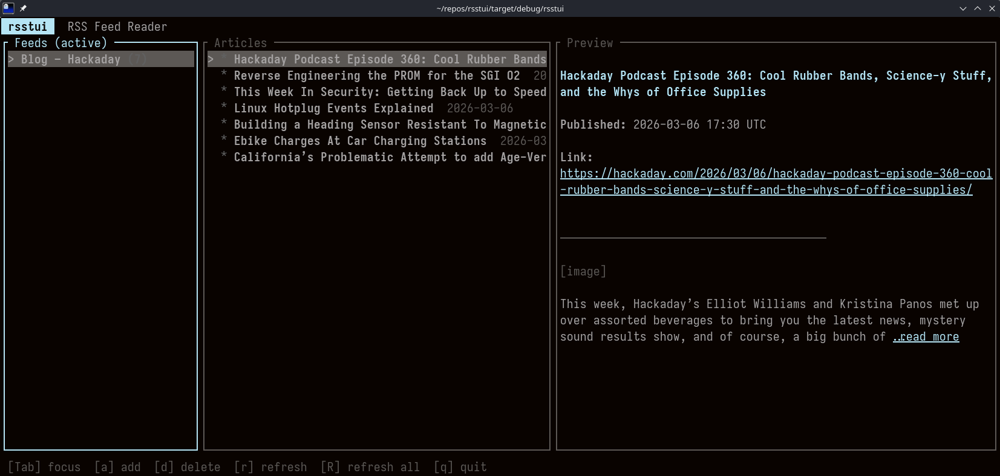

# rsstui

A terminal-based RSS/Atom feed reader built with [ratatui](https://github.com/ratatui-org/ratatui) and [tokio](https://tokio.rs/).



```
┌─ Feeds ──────────────┬─ Articles ───────────────────────┬─ Preview ─────────────────────────────────────────┐
│ Hacker News (12)     │ > Ask HN: Best Rust resources    │ Ask HN: Best Rust resources                       │
│ This Week in Rust    │   New async runtime benchmarks   │ Published: 2026-03-06  |  Link: news.ycombinator… │
│ Lobsters            │   Rust 2024 edition released      │                                                   │
│                      │   How I rewrote my app in Rust   │ I have been learning Rust for about six months    │
│                      │                                  │ and wanted to share some of the resources I found │
│                      │                                  │ most helpful...                                   │
└──────────────────────┴──────────────────────────────────┴───────────────────────────────────────────────────┘
```

## Features

- Three-pane layout: feed list, article list, and article preview
- Supports RSS 2.0, Atom 1.0, and JSON Feed
- Async background fetching — the UI never blocks while feeds load
- HTML article content rendered as styled Markdown in the terminal
- Unread counts per feed, with persistent read/unread state across sessions
- Open any article in your system browser with a single key
- Subscriptions and read state saved to `~/.local/share/rsstui/feeds.json`

## Requirements

- Rust 1.75+ (for the `let-else` and async features used throughout)
- Linux or macOS

## Installation

### Binaries
Check the [releases](https://github.com/PeterGrace/rsstui/releases) for the latest binaries, or packages!  

### From source

```sh
git clone https://github.com/petegrace/rsstui
cd rsstui
cargo install --path .
```

The binary will be placed in `~/.cargo/bin/rsstui`. Make sure that directory is on your `PATH`.

### Build only (without installing)

```sh
cargo build --release
# binary is at ./target/release/rsstui
```

## Usage

```sh
rsstui
```

On first run the feed list is empty. Press `a` to add your first feed URL.

## Keybindings

### Navigation

| Key | Action |
|-----|--------|
| `Tab` / `Shift-Tab` | Cycle focus between Feeds, Articles, and Preview panes |
| `j` / `Down` | Move down in the focused list; scroll preview down |
| `k` / `Up` | Move up in the focused list; scroll preview up |
| `g` | Jump to top of focused list / preview |
| `G` | Jump to bottom of focused list |
| `Enter` | Advance focus (Feeds -> Articles -> Preview) |

### Feeds

| Key | Action |
|-----|--------|
| `a` | Open the "add feed" dialog — paste a feed URL and press Enter |
| `d` | Delete the selected feed (prompts for confirmation) |
| `r` | Refresh the selected feed |
| `R` | Refresh all feeds |

### Articles

| Key | Action |
|-----|--------|
| `m` | Toggle read/unread on the selected article |
| `o` | Open the selected article in the system browser |

### Preview scroll shortcuts (work from any pane)

| Key | Action |
|-----|--------|
| `u` | Scroll preview up 5 lines |
| `d` | Scroll preview down 5 lines |

### Global

| Key | Action |
|-----|--------|
| `q` / `Ctrl-C` | Quit |

## Data storage

Feed subscriptions and per-article read state are stored in:

```
~/.local/share/rsstui/feeds.json
```

The path respects `$XDG_DATA_HOME` if set. Saves are atomic (write to a temp file, then rename) so a crash cannot corrupt your subscription list.

## Architecture

```
main.rs          tokio entry point, terminal setup/teardown, async event loop
app.rs           App struct — all UI state, keyboard handling, mpsc coordination
ui.rs            ratatui rendering (three panes, modals, status bar)
feed.rs          Article / FeedData types, async fetch_feed (feed-rs + reqwest)
markdown.rs      HTML -> Markdown (htmd) -> styled ratatui Text (pulldown-cmark)
storage.rs       Atomic JSON persistence (~/.local/share/rsstui/feeds.json)
error.rs         AppError enum (Http, Parse, Io, Serde, Terminal)
```

Background fetches run on the tokio thread pool and communicate results back to the main loop via an unbounded `mpsc` channel. The event loop `select!`s over keyboard events and a 100 ms tick, calling `app.poll_messages()` each tick to drain completed fetches.

## License

MIT — see [LICENSE](LICENSE).
